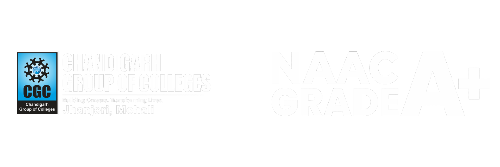

# WEB-DEV SUMMIT 2023 - Event Website

A modern, responsive website for the WEB-DEV SUMMIT 2023 event organized by the Department of Computer Science & Engineering and Department of Research & Development at Chandigarh Group of Colleges, Jhanjeri.



## 🎯 Event Overview

The WEB-DEV SUMMIT 2023 is a groundbreaking conference that brings together web developers, designers, engineers, and digital experts from across the globe. The event took place on **November 2, 2023** at Chandigarh Group of Colleges, Jhanjeri, Mohali.

**Theme:** "Where Innovation Meets Code"

## ✨ Features

- **Responsive Design**: Mobile-friendly and works across all devices
- **Modern UI/UX**: Clean, professional design with smooth animations
- **Interactive Elements**: Dynamic event cards and modals
- **Social Integration**: Direct links to social media platforms
- **Registration System**: Integrated Google Forms for event registration
- **Expert Talks**: Dedicated sections for speaker information
- **Contact Information**: Complete contact details and location

## 🛠️ Technologies Used

### Frontend
- **HTML5**: Semantic markup structure
- **CSS3**: Modern styling with custom properties and flexbox/grid layouts
- **JavaScript (Vanilla)**: Interactive functionality and DOM manipulation
- **jQuery**: Enhanced DOM manipulation and animations

### Frameworks & Libraries
- **Materialize CSS**: Material design components
- **Font Awesome**: Icon library for social media and UI icons
- **Google Fonts**: Custom typography (Tektur, Chakra Petch)

### External Services
- **Google Forms**: Event registration system
- **Google Maps**: Location embedding
- **Bootstrap**: Additional responsive utilities

## 📁 Project Structure

```
├── index.html              # Main HTML file
├── style.css              # Main stylesheet
├── eng.js                 # JavaScript functionality
├── README.md              # Project documentation
├── fav.png                # Favicon
├── final.png              # Main logo
├── CGC Updated logo.png   # College logo
├── NAAC+ White Logo.png   # NAAC accreditation logo
└── img/                   # Image assets
    ├── about.gif          # About section animation
    ├── banner.jpg         # Banner images
    ├── code.jpg           # Coding competition image
    ├── copy.jpg           # Copyright talk image
    ├── hack.jpeg          # Hacking expert talk image
    ├── webdev.jpg         # Web development image
    └── [other images...]
```

## 🎨 Design Features

### Color Scheme
- Primary: Blue tones (#77CBEF, #3c83f6)
- Secondary: Dark theme with white accents
- Accent: Gradient backgrounds and hover effects

### Typography
- **Tektur**: Modern, tech-inspired headings
- **Chakra Petch**: Clean, readable body text
- **Rubik**: UI elements and navigation

### Visual Elements
- Animated GIFs for dynamic content
- Interactive event cards with hover effects
- Smooth scrolling navigation
- Responsive hamburger menu for mobile

## 🏃‍♂️ Getting Started

### Prerequisites
- Modern web browser (Chrome, Firefox, Safari, Edge)
- Internet connection (for external resources)

### Installation

1. **Clone the repository**
   ```bash
   git clone https://github.com/JadonAman/webdev-summit.git
   cd "webdev-summit"
   ```

2. **Open the website**
   - Simply open `index.html` in your web browser
   - Or use a local server:
   ```bash
   # Using Python
   python -m http.server 8000
   
   # Using Node.js
   npx http-server
   ```

3. **View the website**
   - Navigate to `http://localhost:8000` (if using local server)
   - Or directly open the `index.html` file

## 📱 Responsive Design

The website is fully responsive and optimized for:
- **Desktop**: Full layout with all features
- **Tablet**: Adapted layout with touch-friendly navigation
- **Mobile**: Hamburger menu and stacked content layout

## 🏫 About Chandigarh Group of Colleges

Chandigarh Group of Colleges Jhanjeri is a NAAC A+ accredited institution established in 2012. Known for excellence in research and teaching, CGC Jhanjeri has been awarded the prestigious NAAC A+ accreditation with a CGPA of 3.46/4.0.


## 📄 License

This project is created for educational and promotional purposes for the WEB-DEV SUMMIT 2023 event.


**Developed for WEB-DEV SUMMIT 2023**  
*Where Innovation Meets Code*

---

*Last updated: November 2023*
